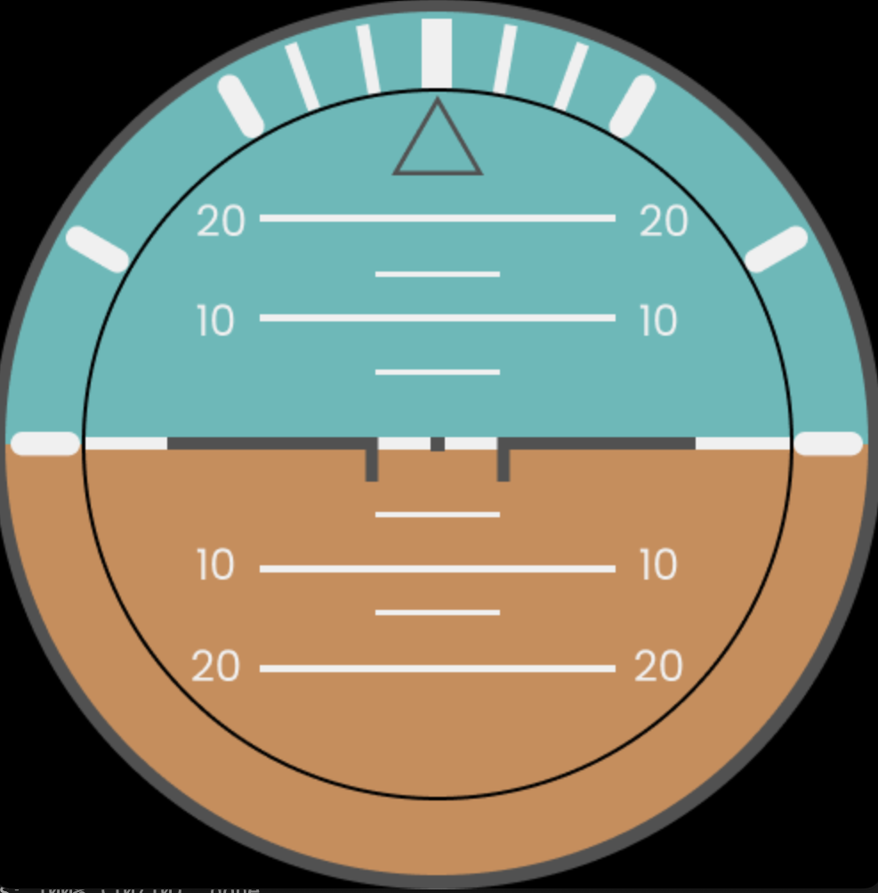

# Artificial horizon built with python -- windows support only

Attitude indicator build with pygame and sockets to extract data from FlightGear and simulate the flight instrument.

## Table of contents

- [Overview](#overview)
- [Instalation guide](#instalation-guide)

## Overview

### Screenshots

### Video presentation

https://user-images.githubusercontent.com/87568470/178217898-db475a56-e7d7-4526-9cc7-5fe92c9f585e.mp4

## Instalation guide

### Step 1

Clone the repository on your local machine.

### Step 2

Copy the "export_orientation.xml" file to the FlightGear\bin (default location C:\Program Files\FlightGear\bin).

### Step 3

Open fgstart.bat

### Step 4

Run main.py
